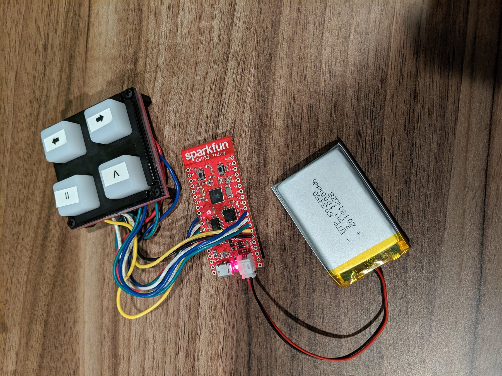
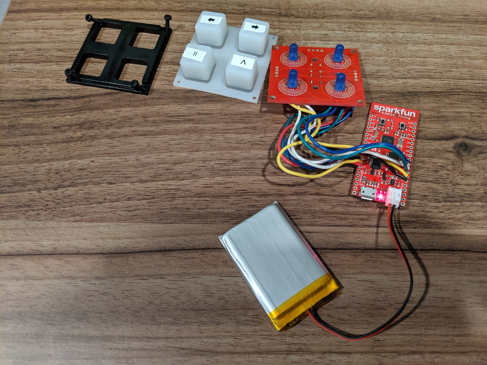
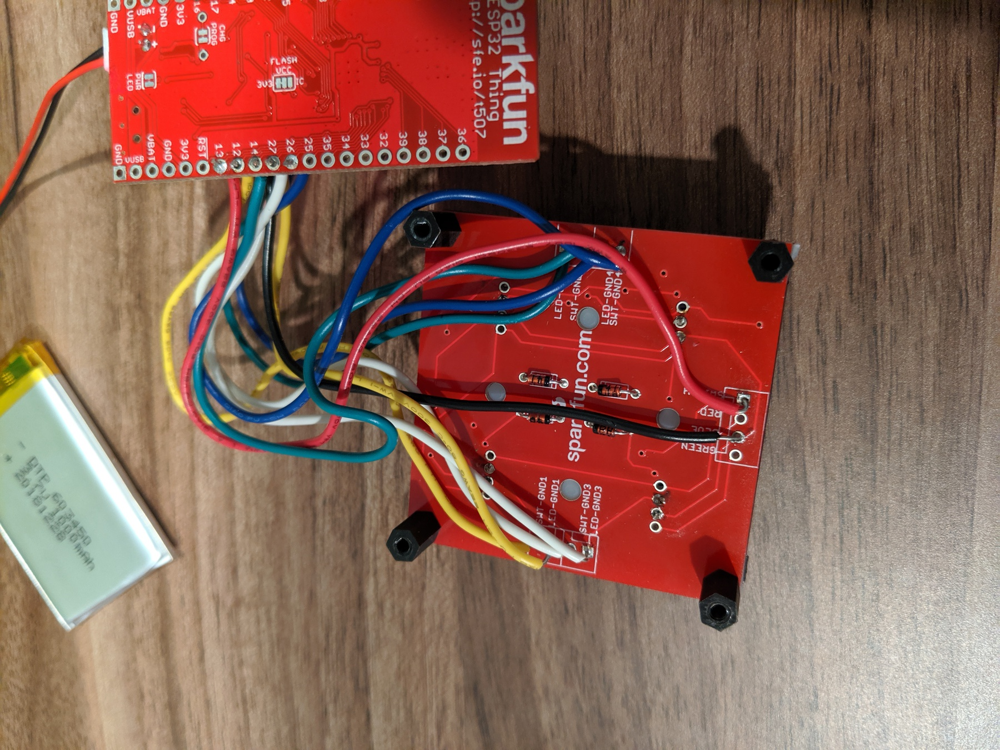

This is a hobby project for controlling a sonos player using an ESP32 board and a button pad. I got the idea for the 
project while working in my garage and having gloves on or dirty hands and not wanting to mess with my phone to control the 
sonos player in there. Obviously the lazy thing would have been to get a voice assistant in there, but what fun is that?

I wanted something that I could place anywhere in the garage. Being able to run from battery (low power) and WiFi were 
important considerations. I was clearly looking for a fun project here, otherwise I probably would have gone with some 
AWS button concoction, or perhaps gone with one of the commercially available sonos remote control options.

So I wound up going with a handful of stuff from Sparkfun:
- [ESP32 Thing](https://www.sparkfun.com/products/13907)
- [2x2 Button Pad](https://www.sparkfun.com/products/9277)
- [Buttons](https://www.sparkfun.com/products/7836)
- [Buttons Bezel](https://www.sparkfun.com/products/8746)
- [Diodes](https://www.sparkfun.com/products/8588)

The ESP32 fit the bill for the project since it has a ridiculously low power draw when it's in sleep, has WiFi 
built in and the sparkfun board comes with a LIPO battery charger on it.

## Software
I had initially used the Sonos public control API, which goes through Sonos' servers to control your local sonos
player. After getting this all working I found the latency period to be less than ideal. Sonos also
had a multi day service outage while I was wrapping up work on that version. I settled on using the local network UPnP based 
API that the official sonos applications use. Much of the detail on this came from [SoCo](https://github.com/SoCo/SoCo), so 
thanks for that!

Since my hardware design has four buttons, the software supports four opertations:
- Play/Pause
- Next track
- Volume up
- Volume Down

If you want to use this project yourself, you'll need to first find the UID of the sonos player that you want to control. 
For this I recommend using the [SoCo](https://github.com/SoCo/SoCo) library. Once you've got it installed locally:

```
>>> import soco
>>> [zone.uid for zone in soco.discover() if zone.player_name == 'Garage']
['RINCON_XXXXXXXXXXXX']
```

Set the SONOS_UID constant in `sonos_buttons.cpp` to the sonos player UID you want to control and while you're there set the
SSID and PASSWORD macros to your WiFi credentials..

### Building

You'll need an ESP32 development environment setup: see [these instructions](https://docs.espressif.com/projects/esp-idf/en/v3.2.3/get-started/index.html) and you'll need the [ULP Toolchain](https://docs.espressif.com/projects/esp-idf/en/v3.2.3/api-guides/ulp.html#installing-the-toolchain) too. 
Because the esp-arduino module currently requires the v3.2 branch of esp-IDF, you'll need to stick with that version for compiling. 
It looks like the 4.0 branch completely changed how builds work so this project would likely need some updates too.

Once you have the environment setup, run `make menuconfig` and set the default serial port your ESP32 board appears as. This is under the "Serial flasher config" menu item. There's a ton of other options, but that's the only one you need to change.

To flash run `make flash` and then to see serial output run `make monitor`. This will build all of the FreeRTOS stuff too, which is a lot, so make's `-j` argument could be helpful here to use multiple processors.

### Implementation

Since power is a concern here, I wanted to make use of the deep sleep feature of the ESP32 SOC. This allows it to go into a
state that draws *micro*amps of current while still being able to respond to external stimuli. See [the ESP32 sleep docs](https://docs.espressif.com/projects/esp-idf/en/latest/api-reference/system/sleep_modes.html) for details on that.

After waking up from a deep sleep the ESP32 has to rejoin wifi, which usually takes a couple of seconds, so one of the hardest things
was to get it to remember what button was pressed to wake it up from deep sleep. I didn't have a lot of luck with the built-in 
touchpad, or GPIO (ext1) based wakeup solutions. The ext1 stuff kept going into sleep/wake loops, and the touchpad wakeups 
wouldn't report the correct GPIO input for the wakeup source. 

The ESP32 supports wakeup events from a Ultra Low Power (ULP) processor, which is a minimal extra processor that can run some limited code and can wakeup the main processor while
sharing memory with it. When this ULP processor is running and the main processor is in deep sleep, the board supposedly draws current in the 100 microamp
range, so it should still last a very long time on a 1000mah battery. An important point is that during deep sleep, most of main
memory is powered off.  When it wakes up it is effectively like a reboot but the so-called RTC memory is still active. The 
main program can store stuff in this memory (which is 16K I think) and the ULP processor can use an 8K subset of this
which is shared with the main program. 
There isn't a C compiler for the ULP processor, so that part has to be written in assembly with a rather limited 
[instruction set](https://docs.espressif.com/projects/esp-idf/en/latest/api-guides/ulp_instruction_set.html). The ULP program 
lifecycle is a little strange. It's intended to run periodically, woken up by a configurable timer internal to the SOC. In my
case I have it running every 100 milliseconds and it will check to see if any buttons are pressed. If it detects a button press
it will write the button that was pressed into the shared RTC memory and wakeup the main processor(s). If not, it will halt and be restarted by the timer.

On boot the main application does the following:
- Initialize the GPIO pins for controlling the button LEDs and button readers
- Start a FreeRTOS task for controlling the LEDs based on a global variable. This way it can handle keeping the LEDS operational while the CPU is blocked in IO. How cool is it that a tiny computer like this supports real multitasking?
- If we're not waking from sleep, do a cute blinky dance to show off
- If we are waking from sleep, check if the ULP program stashed a button press to be acted on in the first button input loop
- Join wifi and if that fails, do some angry blinking.
- Look in the [Preferences](https://github.com/espressif/arduino-esp32/tree/master/libraries/Preferences) stored on the SOC's flash for the Sonos player's IP address 
- If we don't know the IP address, perform Sonos discovery to find it
- Enter a loop to check for button inputs.
- If a button input occurs, light up the button LED for the duration of the association operation for user feedback and perform that operation.
- After roughly 30 seconds of no button presses (didn't want to introduce a clock, so just based on loop counting hueristics), prepare for deep sleep

Deep Sleep preparation entails:
- Turn off wifi
- Setup RTC IO for the button GPIO inputs and outputs used for the buttons.
- Configure wakeup from ULP sources
- Set the ULP processor timer to run the ULP program 100ms after it halts
- Start the ULP Program
- Enter deep sleep

The ULP Program uses essentially the same mechanism as the main processor code for detecting button proesses so the following mostly applies to both. There is one pin for each button plus a single "reader" pin, details of which are described in the hardware section.
- Configure the reader pin for input only, with the pullup resistor enabled.
- Set the four button pins to HIGH
- Loop over each button pin
    - Set the button pin to LOW
    - Wait a short time
    - Read from the reader pin
    - If the reader pin reads as LOW, then we increment a bounce counter for the button pin, if it's HIGH then we set the bounce counter to 0
    - Set the button pin back to HIGH
    - If the bounce counter for a button reaches 3, consider it a button press.
- If a button is pressed:
    - Write the pressed button into a variable in memory shared between the ULP and the main processors.
    - Wakeup the main processor
    - Disable the ULP wakeup timer so it doesn't keep running with the main processor is running
    - Halt the ULP program

## Hardware

The hardware bits involved here beyond the ESP32 board are a 2x2 button breakout board from sparkfun, along with the associated 
silicon buttons and some little plastic bits to hold everything together. The breakout board has places for full RGB LEDs to
go under each button but I went with simple blue LEDS. These LEDS are meant to provide feedback when the button is pressed. 
After the button press is registered, the LED is lit until the operation associated with it is completed. 
These LEDS are also used all together during startup with a brief flash to indicate successfully joining the wifi network, or 
a series of angry flashes if joining the wifi network failed. 

The button breakout board also has holes for diodes to prevent signals bleeding between rows when doing matrix scanning of the 
button array. I'm not great with electronics stuff, but I don't think this is neccessary with a 2x2 grid where each button has it's own input anyway and is only needed for 4x4 grids. I dutifully soldered them on anyway.

The button side of things is wired up with the switch ground terminals on the breakout board, wired to pins 12, 14, 27 and 26.
The reader pin on the buttons is wired to the switch terminal on the breakout board and GPIO 33 on the ESP32.
You can change this around in the code, but for the ULP bit to work the GPIO pins for the buttons (not LEDS) MUST be 
available from the RTC controller. See section 4.11, RTC_MUX Pin List, on page 57 of the [ESP 32 Technical Reference Manual](https://www.espressif.com/sites/default/files/documentation/esp32_technical_reference_manual_en.pdf).

The LED side of things is wired up to GPIO pins 25, 4, 5, and 18 in the same order with the buttons listed above. These are wired
to the LED GND terminals on the breakout baord. GPIO 32 is used to power these in the `ledLoop()` function and is wired to the
Blue LED terminal on the breakout board. The LED pins were chosen to also be compatible with the Sparkfun WROOM dev board as well.

## Pictures

### Full Project


### Breakout board front


### Breakout board back


